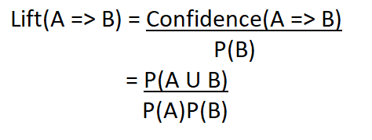
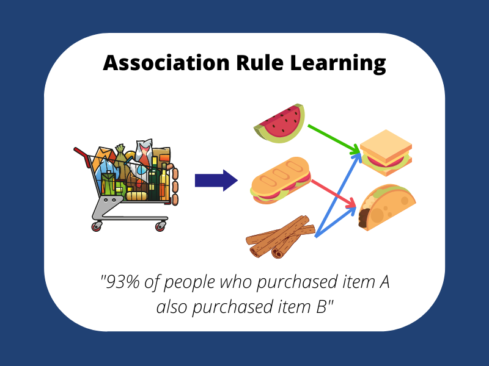

# Association Rule Learning for Market Basket Optimization

## Developer Information
**Name:** Yuvraj Singh Chowdhary  
**Email:** chowdharyyuvrajsingh@gmail.com  
**LinkedIn:** [Yuvraj Singh Chowdhary](https://www.linkedin.com/in/yuvraj-singh-chowdhary/)  
**Reddit:** [SuccessfulStrain9533](https://www.reddit.com/user/SuccessfulStrain9533/)  

I am a passionate developer specializing in data science and machine learning. My recent project involves implementing association rule learning using the Apriori algorithm to optimize market basket analysis. Connect with me on LinkedIn or Reddit for collaboration opportunities or to discuss innovative ideas.

---

## Technology Logos


---

## Project Overview
In this project, we implement association rule learning using the Apriori algorithm to identify the best product pairs for a "Buy 1 Get 1 Free" scheme in a retail setting. The analysis is based on transaction data, which helps in understanding customer purchase behavior and optimizing product placement and promotions.

 

### Objectives
The primary objective is to find the best pairs of products that frequently appear together in transactions. These pairs can be used to design effective promotional strategies such as "Buy 1 Get 1 Free."

---

## Dataset
The dataset used for this project is `Market_Basket_Optimisation.csv`, which contains 7500 transactions. Each row represents a transaction, and each column represents a product purchased in that transaction.

### Data Preprocessing
Data preprocessing is crucial for transforming the dataset into a suitable format for the Apriori algorithm.

```python
import numpy as np
import pandas as pd
import matplotlib.pyplot as plt

# Load the dataset
dataset = pd.read_csv('Market_Basket_Optimisation.csv', header=None)

# Data Preprocessing
transactions = []
for i in range(0, 7501):
    transactions.append([str(dataset.values[i, j]) for j in range(0, 20)])
```

### Apriori Algorithm Implementation
The Apriori algorithm is used to identify frequent item sets and generate association rules. 

```python
from apyori import apriori

# Apply the Apriori algorithm
rules = apriori(transactions=transactions, min_support=0.003, min_confidence=0.2, min_lift=3, min_length=2, max_length=2)
results = list(rules)

# Function to inspect the results
def inspect(results):
    lhs = [tuple(result[2][0][0])[0] for result in results]
    rhs = [tuple(result[2][0][1])[0] for result in results]
    supports = [result[1] for result in results]
    confidences = [result[2][0][2] for result in results]
    lifts = [result[2][0][3] for result in results]
    return list(zip(lhs, rhs, supports, confidences, lifts))

# Convert results into a DataFrame
resultsinDataFrame = pd.DataFrame(inspect(results), columns=['Product Bought', 'Product Likely To Buy', 'Support', 'Confidence', 'Lift'])

# Display the top 10 results sorted by Lift
resultsinDataFrame.nlargest(n=10, columns='Lift')
```

### Key Findings
Using the Apriori algorithm, we identified the following product pairs as the best candidates for the "Buy 1 Get 1 Free" scheme:
- **Fromage Blanc and Honey**: These products frequently appear together in transactions and have high lift and confidence values.

---

## Instructions for Collaborators and Users
1. **Data Preprocessing**: Modify the data preprocessing phase according to your business dataset. Ensure that transactions are properly formatted for the Apriori algorithm.
2. **Model Parameters**: Adjust the `min_support`, `min_confidence`, and other parameters based on your business requirements and dataset characteristics.
3. **Evaluation**: Use the results to design promotional strategies and optimize product placements.

---

## Project Files
The project repository contains the following files:
- `Market_Basket_Optimisation.csv`: The dataset used for analysis.
- `association_rule_learning.py`: The main Python script implementing the Apriori algorithm.
- `Source` folder: Contains images related to the project.





## License
This project is licensed under the MIT License. See the [LICENSE](LICENSE) file for details.
